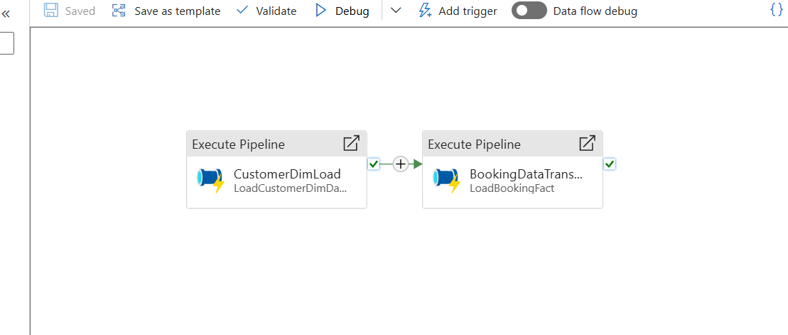
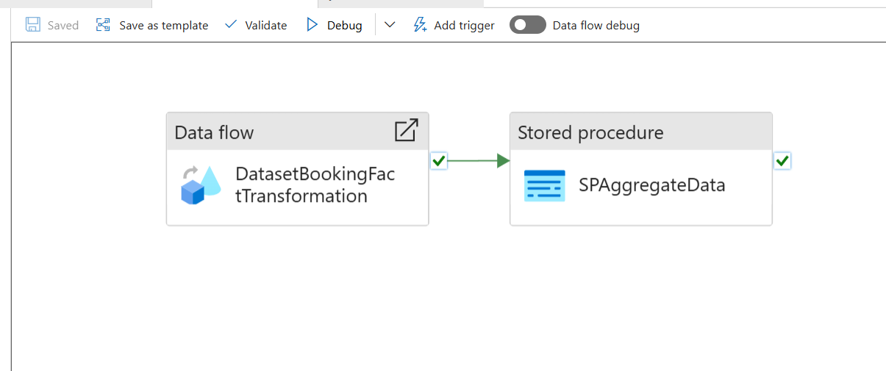

# AirBnB CDC Ingestion Pipeline

This project implements a near real-time data ingestion and transformation pipeline for AirBnB using Azure Data Factory, Synapse Analytics, CosmosDB, and other Azure technologies. It ensures efficient data processing and automated updates to maintain an up-to-date data warehouse.

## **Tech Stack**

- **Azure Data Factory (ADF)**: Orchestration of pipelines for data movement and transformations.
- **Azure Data Lake Storage (ADLS)**: Storage for raw and intermediate data.
- **Azure Synapse Analytics**: Data warehouse for analytical queries.
- **CosmosDB**: Source of change data for Bookings events.
- **Python**: Custom data generation scripts.
- **SQL**: Database and transformation logic.

---

## **Pipeline Features**

1. **Hourly SCD-1 Updates**:
   - Reads customer data from ADLS hourly.
   - Performs Slowly Changing Dimension Type 1 (SCD-1) updates on the `customer_dim` table in Synapse Analytics.

2. **Change Data Capture (CDC)**:
   - Captures incremental booking events from CosmosDB using change feeds.
   - Processes events in Azure Data Factory and upserts transformed data into Synapse.

3. **Automated Workflows**:
   - Configured triggers and dependencies in ADF to enable seamless end-to-end automation.

## **Pipeline Configuration**

### **1. AirBnBCDCPipeline** (Triggering Both Pipelines)

This pipeline triggers the **LoadBookingFact Pipeline** and the **LoadCustomerDim Pipeline** in sequence. It ensures that the customer data and booking data are processed and loaded correctly into the target tables.

The JSON configuration for this pipeline is found in the **[AirBnBCDCPipeline](./pipelines/AirBnBCDCPipeline.json)**.

### **2. LoadCustomerDim Pipeline** (CDC for Customer Data)

This pipeline performs a **CDC** operation to update customer records in the **Customer Dimension Table**. It uses change data from the source and applies necessary transformations before inserting/updating the customer data in **Synapse SQL Pool**.

The pipeline configuration can be found in the **[LoadCustomerDim Pipeline](./docs/LoadCustomerDim.md)**.

### **3. LoadBookingFact Pipeline** (With Data Flow Activity)

This pipeline includes a **Data Flow Activity** that performs several transformations on booking data. It uses data from **CosmosDB** and **Synapse SQL Pool** to enrich and update the **Booking Fact Table** in **Azure Synapse**.

The configuration can be found in the **[LoadBookingFact Pipeline](./docs/LoadBookingFact.md)**.

## **Conclusion**

This **Airbnb CDC Ingestion Pipeline** provides a comprehensive solution for processing and transforming booking and customer data, ensuring that it is ingested into **Azure Synapse SQL Pool** for further analytics and reporting. The **AirBnBCDCPipeline** coordinates the execution of the other pipelines, while the **LoadBookingFact Pipeline** includes a data flow for detailed transformation logic.
