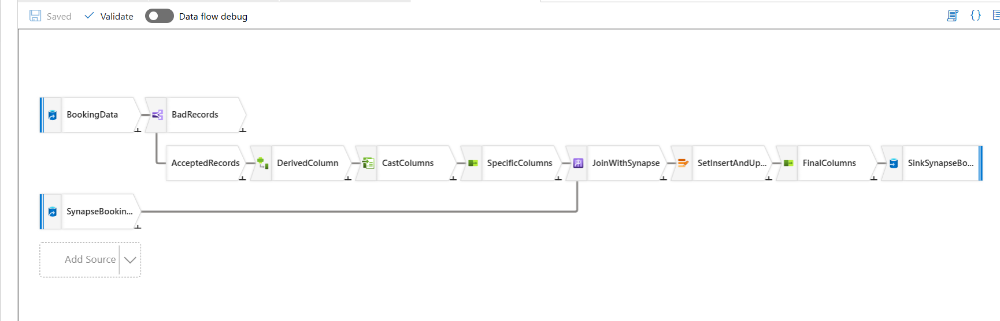

# AirBnB CDC Ingestion Pipeline

This project implements a near real-time data ingestion and transformation pipeline for AirBnB using **Azure Data Factory (ADF)**, **Synapse Analytics**, **CosmosDB**, and other Azure technologies. It ensures efficient data processing and automated updates to maintain an up-to-date data warehouse.

## **Tech Stack**

- **Azure Data Factory (ADF)**: Orchestration of pipelines for data movement and transformations.
- **Azure Data Lake Storage (ADLS)**: Storage for raw and intermediate data.
- **Azure Synapse Analytics**: Data warehouse for analytical queries.
- **CosmosDB**: Source of change data for booking events.
- **Python**: Custom data generation scripts.
- **SQL**: Database and transformation logic.

---

## **Pipeline Features**

1. **Hourly SCD-1 Updates**:
   - Reads customer data from **ADLS** every hour.
   - Performs **Slowly Changing Dimension Type 1 (SCD-1)** updates on the `customer_dim` table in **Synapse Analytics**, ensuring that the customer data is always up to date.
   
2. **Change Data Capture (CDC)**:
   - Captures incremental booking events from **CosmosDB** using **change feeds**.
   - Processes these events in **Azure Data Factory (ADF)**, performs necessary transformations, and upserts the resulting data into **Synapse**.
   
3. **Automated Workflows**:
   - Configures triggers and dependencies in ADF to automate the entire process, ensuring seamless and continuous data flow.

---

## **Pipeline Configuration**

### **1. AirBnBCDCPipeline** (Triggering Both Pipelines)

The **AirBnBCDCPipeline** orchestrates the execution of both the **LoadBookingFact Pipeline** and the **LoadCustomerDim Pipeline**. This pipeline ensures that customer and booking data are processed and loaded correctly into their respective target tables.

The **AirBnBCDCPipeline** is responsible for:
- Triggering the **LoadCustomerDim Pipeline** to ensure customer data is up-to-date.
- Triggering the **LoadBookingFact Pipeline** to update booking information.

The JSON configuration for this pipeline is available in the **[AirBnBCDCPipeline.json](./pipelines/AirBnBCDCPipeline.json)**.

---

### **2. LoadCustomerDim Pipeline** (CDC for Customer Data)

The **LoadCustomerDim Pipeline** is responsible for capturing **Change Data Capture (CDC)** events for customer data. This pipeline reads raw customer data from **ADLS**, performs necessary transformations, and upserts the customer records into the **Customer Dimension Table** in **Synapse SQL Pool**.

#### Key Pipeline Activities:
- **Get Metadata**: Retrieves metadata for each file in the source folder.
- **ForEach Loop**: Iterates over each file and processes it:
  - **Copy File to Synapse**: Moves customer data into the **Synapse SQL Pool** using an **Upsert** operation based on `customer_id`.
  - **Move File to Archive**: Archives the raw customer data files after successful ingestion.
  - **Delete Raw Data File**: Removes the raw files from the source once they are processed.

For more detailed configuration and steps of the **LoadCustomerDim Pipeline**, refer to **[LoadCustomerDim](./docs/LoadCustomerDim.md)**.

---

### **3. LoadBookingFact Pipeline** (With Data Flow Activity)

The **LoadBookingFact Pipeline** performs data transformation on booking data using **Azure Data Factory Data Flow**. This data flow includes multiple transformations and enrichment steps before upserting the booking data into the **Booking Fact Table** in **Azure Synapse**.

#### Key Pipeline Activities:
- **Data Flow Activity**:
  - **Data Quality Check**: Validates that the `check_out_date` is later than the `check_in_date`.
  - **Derived Column**: Calculates additional fields like `stay_duration`, `booking_year`, `booking_month`, and `full_address`.
  - **Join with Synapse**: Compares incoming data with existing data in Synapse to identify new and updated bookings.
  - **Alter Row Policies**: Determines if a row should be inserted or updated based on the existence of `booking_id`.
  - **Final Columns**: Ensures the correct set of columns is written to the target table in Synapse.

- **Stored Procedure Activity**:
  After the transformation, the **SPAggregateData** activity calls the stored procedure **[BookingAggregation](../sql/BookingAggregation.sql)** to aggregate booking data by customer country and update the **BookingCustomerAggregation** table.

For detailed configuration and steps of the **LoadBookingFact Pipeline**, refer to **[LoadBookingFact](./docs/LoadBookingFact.md)**.

---

## **Conclusion**

The **AirBnB CDC Ingestion Pipeline** is designed to process and transform both booking and customer data, ensuring that they are ingested and continuously updated in **Azure Synapse SQL Pool** for further analytics and reporting. 

- The **AirBnBCDCPipeline** orchestrates the execution of **LoadCustomerDim** and **LoadBookingFact** pipelines.
- **LoadCustomerDim** pipeline ensures customer data is updated with CDC events.
- **LoadBookingFact** pipeline performs complex data transformations and aggregates booking data, ensuring the **Booking Fact Table** is always current.

With this pipeline architecture, **AirBnB** can efficiently ingest and process data, keeping its data warehouse in sync with real-time changes.
