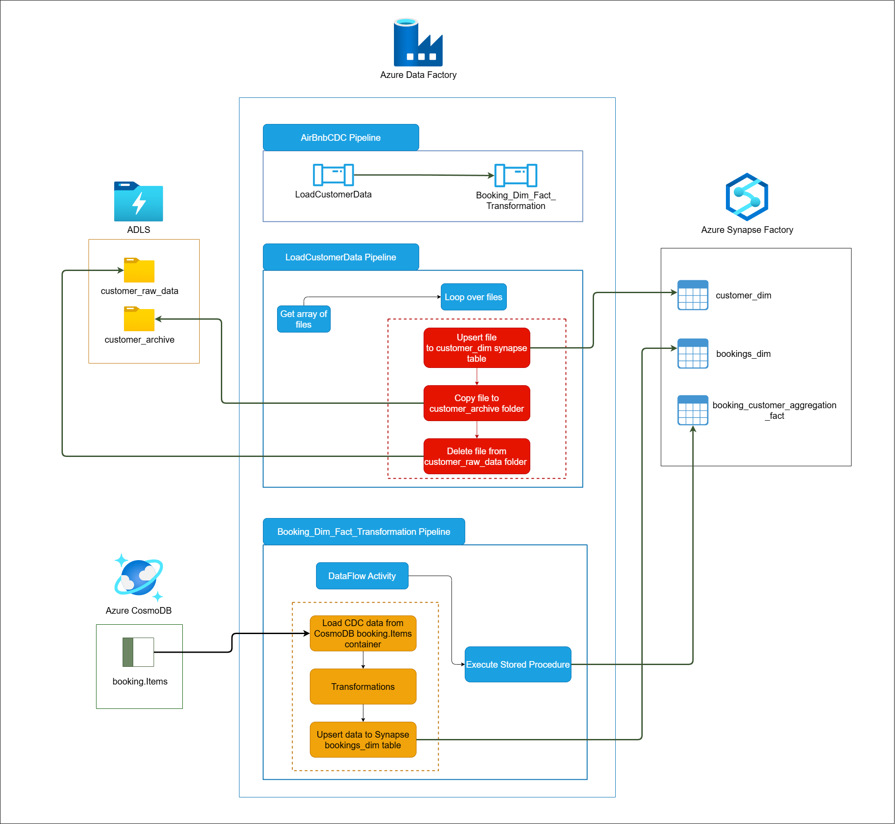

# AirBnB CDC Ingestion Pipeline

This project implements a data ingestion and transformation pipeline for AirBnB using **Azure Data Factory (ADF)**, **Synapse Analytics**, **CosmosDB**, and other Azure technologies. It ensures efficient data processing and automated updates to maintain an up-to-date data warehouse.

Below is the architecture diagram showcasing how data flows through the different components:

---

## **Tech Stack**

- **Azure Data Factory (ADF)**: Orchestration of pipelines for data movement and transformations.
- **Azure Data Lake Storage (ADLS)**: Storage for raw and intermediate data.
- **Azure Synapse Analytics**: Data warehouse for analytical queries.
- **CosmosDB**: Source of change data for booking events.
- **Python**: Custom data generation scripts.
- **T-SQL**: Database and transformation logic.

---

## **Pipeline Features**

1. **Hourly SCD-1 Updates**:
   - Reads customer data from **ADLS** every hour.
   - Performs **Slowly Changing Dimension Type 1 (SCD-1)** updates on the `customer_dim` table in **Synapse Analytics**, ensuring that the customer data is always up-to-date.

2. **Change Data Capture (CDC)**:
   - Captures incremental booking events from **CosmosDB** using **change feeds**.
   - Processes these events in **Azure Data Factory (ADF)**, performs necessary transformations, and upserts the resulting data into **Synapse**.

3. **Automated Workflows**:
   - Configures triggers and dependencies in ADF to automate the entire process, ensuring seamless and continuous data flow.

---

## **LoadCustomerDim Pipeline (CDC for Customer Data)**

The **LoadCustomerDim** pipeline implements Change Data Capture (CDC) to process customer data. It retrieves raw customer files from **Azure Data Lake Storage (ADLS)**, applies transformations, and updates the **airbnb.customer_dim** in **Azure Synapse Analytics**. The pipeline also manages raw data file archiving and cleanup to maintain an organized data lake.

---

### **Pipeline Activities**

#### **1. Get Metadata of Files**

**Activity Name:** `Get MetadataOfEachFileInCustomerRawDataContainer`

- Retrieves metadata for each file in the **customer_raw_data** folder on ADLS.
- This metadata is used to identify the files to be processed in the subsequent activity.

---

#### **2. Process Each File**

**Activity Name:** `ForEachFileInCustomerRawContainer`

This activity iterates over each raw customer file identified in the previous step and performs the following sub-steps:

1. **Copy File Data to Synapse SQL Pool**  
   - **Purpose:** Transfers raw customer data to the **airbnb.customer_dim** table in **Azure Synapse Analytics**.  
   - **Method:** Performs an **Upsert** operation using the `customer_id` as the primary key.  
   - **Format:** Source files are in DelimitedText format.

2. **Archive Processed Files**  
   - **Purpose:** Moves successfully processed files from the **customer_raw_data** folder to the **customer_archive** folder.  
   - **Benefit:** Ensures raw files are preserved for future reference while maintaining a clean source folder.

3. **Delete Raw Files**  
   - **Purpose:** Deletes raw files from the **customer_raw_data** folder after successful archiving.  
   - **Benefit:** Prevents duplicate processing and optimizes storage space in the data lake.

---

#### **Pipeline Configuration File**

You can find the JSON configuration file for this pipeline here:  
[LoadCustomerDimDataToSynapse.json](./pipelines/LoadCustomerDimDataToSynapse.json)

---

## **LoadBookingFact Pipeline**

The **LoadBookingFact** pipeline performs several data transformations to update the **airbnb.bookings_fact** table in **Azure Synapse**. It uses data from **CosmosDB** and **Synapse SQL Pool** for enriching and updating booking data.

---

### **Pipeline Activities**

#### **1. Data Flow Activity** (DatasetBookingFactTransformation)

This activity uses **Azure Data Factory Data Flow** to transform the raw booking data. It performs several transformations and enrichment on the data before it is written to the **airbnb.bookings_fact** table in **Azure Synapse**.

##### **Transformations**

1. **Data Quality Check**: Ensures that `check_out_date` is later than `check_in_date`.  
2. **Derived Column**: Calculates `stay_duration`, extracts `booking_year`, `booking_month`, and forms a `full_address`.  
3. **Join with Synapse**: Performs a lookup between incoming data and existing records in Synapse to identify new or updated bookings.  
4. **Alter Row Policies**: Determines whether to insert or update a row based on whether `booking_id` already exists in the **airbnb.bookings_fact** table.  
5. **Cast Columns**: Ensures that the data types match the target schema in the **airbnb.bookings_fact** table in **Synapse SQL Pool**.  
6. **Final Columns**: Selects the final set of columns to be written to the **airbnb.bookings_fact** table in **Synapse SQL Pool**.

---

#### **2. Stored Procedure Activity** (SPAggregateData)

After the data flow activity completes successfully, the **SPAggregateData** activity calls a stored procedure to aggregate the transformed booking data. This stored procedure updates the **airbnb.BookingCustomerAggregation** table, which contains aggregated data at the customer level.

##### **Stored Procedure Execution**

- **Stored Procedure Name**: `[airbnb].[BookingAggregation]`  
- **Linked Service**: Azure Synapse Analytics  
- **Dependency**: Depends on the successful completion of the previous data flow activity.  
- **Timeout and Retry**: Timeout of 12 hours and 0 retries if it fails.

##### **Stored Procedure Logic**

1. **Truncates** the **airbnb.BookingCustomerAggregation** table to remove outdated data.  
2. **Aggregates** booking data from the **airbnb.bookings_fact** table by joining with the **airbnb.customer_dim** table. It calculates:  
   - `total_bookings`: The count of bookings per country.  
   - `total_amount`: The sum of booking amounts for each country.  
   - `last_booking_date`: The latest booking date per country.  
3. **Inserts** the aggregated results back into the **airbnb.BookingCustomerAggregation** table.

You can find the SQL script for this stored procedure here:  
[BookingAggregation.sql](./scripts/sql/stored_procedures/booking_aggregation.sql)

---

## **Conclusion**

The **AirBnB CDC Ingestion Pipeline** is designed to process and transform both booking and customer data, ensuring that they are ingested and continuously updated in **Azure Synapse SQL Pool** for further analytics and reporting. 

With this pipeline architecture, **AirBnB** can efficiently ingest and process data, keeping its data warehouse in sync with real-time changes.
