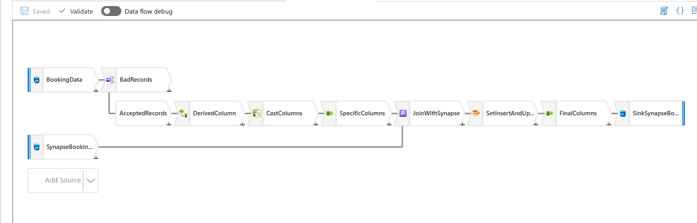

# LoadBookingFact Pipeline

The **LoadBookingFact** pipeline performs several data transformations to update the **airbnb.bookings_fact** table in **Azure Synapse**. It uses data from **CosmosDB** and **Synapse SQL Pool** for enriching and updating booking data.

## **Pipeline Activities**

### **1. Data Flow Activity** (DatasetBookingFactTransformation)

This activity uses **Azure Data Factory Data Flow** to transform the raw booking data. It performs several transformations and enrichment on the data before it is written to the **airbnb.bookings_fact** table in **Azure Synapse**.

#### **Transformations**

1. **Data Quality Check**: Ensures that `check_out_date` is later than `check_in_date`.
2. **Derived Column**: Calculates `stay_duration`, extracts `booking_year`, `booking_month`, and forms a `full_address`.
3. **Join with Synapse**: Performs a lookup between incoming data and existing records in Synapse to identify new or updated bookings.
4. **Alter Row Policies**: Determines whether to insert or update a row based on whether `booking_id` already exists in the **airbnb.bookings_fact** table.
5. **Cast Columns**: Ensures that the data types match the target schema in the **airbnb.bookings_fact** table in **Synapse SQL Pool**.
6. **Final Columns**: Selects the final set of columns to be written to the **airbnb.bookings_fact** table in **Synapse SQL Pool**.

### **2. Stored Procedure Activity** (SPAggregateData)

After the data flow activity completes successfully, the **SPAggregateData** activity calls a stored procedure to aggregate the transformed booking data. This stored procedure updates the **airbnb.BookingCustomerAggregation** table, which contains aggregated data at the customer level.

#### **Stored Procedure Execution**:

- **Stored Procedure Name**: `[airbnb].[BookingAggregation]`
- **Linked Service**: Azure Synapse Analytics
- **Dependency**: This activity depends on the successful completion of the previous data flow activity.
- **Timeout and Retry**: The activity has a timeout of 12 hours and is set to retry 0 times if it fails.

The stored procedure performs the following tasks:

1. **Truncates** the **airbnb.BookingCustomerAggregation** table to remove outdated data.
2. **Aggregates** booking data from the **airbnb.bookings_fact** table by joining with the **airbnb.customer_dim** table. It calculates:
   - `total_bookings`: The count of bookings per country.
   - `total_amount`: The sum of booking amounts for each country.
   - `last_booking_date`: The latest booking date per country.

The stored procedure then inserts the aggregated results back into the **airbnb.BookingCustomerAggregation** table.

The SQL script for this stored procedure can be found at   [BookingAggregation.sql](../scripts/sql/stored_procedures/booking_aggregation.sql) file.

### **Pipeline Configuration**

The configuration for this pipeline is located in the **[LoadBookingFact.json](../pipelines/LoadBookingFact.json)**.
