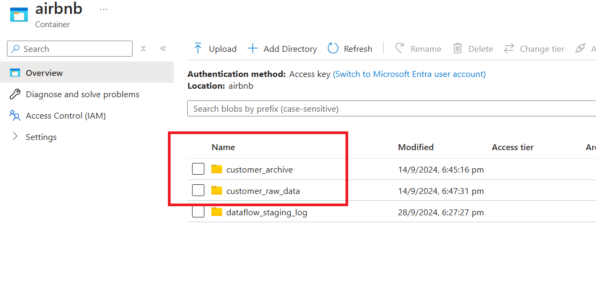

# LoadCustomerDim Pipeline (CDC for Customer Data)

The **LoadCustomerDim** pipeline implements Change Data Capture (CDC) to process customer data. It retrieves raw customer files from **Azure Data Lake Storage (ADLS)**, applies transformations, and updates the **airbnb.customer_dim** in **Azure Synapse Analytics**. The pipeline also manages raw data file archiving and cleanup to maintain an organized data lake.

---

## **Pipeline Activities**

### **1. Get Metadata of Files**

**Activity Name:** `Get MetadataOfEachFileInCustomerRawDataContainer`

- Retrieves metadata for each file in the **customer_raw_data** folder on ADLS.
- This metadata is used to identify the files to be processed in the subsequent activity.

---

### **2. Process Each File**

**Activity Name:** `ForEachFileInCustomerRawContainer`

This activity iterates over each raw customer file identified in the previous step and performs the following sub-steps:

#### **Step 1: Copy File Data to Synapse SQL Pool**

- **Purpose:** Transfers raw customer data to the **airbnb.customer_dim** table in **Azure Synapse Analytics**.
- **Method:** Performs an **Upsert** operation using the `customer_id` as the primary key.
- **Format:** Source files are in DelimitedText format.

#### **Step 2: Archive Processed Files**

- **Purpose:** Moves successfully processed files from the **customer_raw_data** folder to the **customer_archive** folder.
- **Benefit:** Ensures raw files are preserved for future reference while maintaining a clean source folder.

#### **Step 3: Delete Raw Files**

- **Purpose:** Deletes raw files from the **customer_raw_data** folder after successful archiving.
- **Benefit:** Prevents duplicate processing and optimizes storage space in the data lake.

---

## **Pipeline Configuration File**

You can find the JSON configuration file for this pipeline here:  
[LoadCustomerDimDataToSynapse.json](../pipelines/LoadCustomerDimDataToSynapse.json)

---

## **Key Benefits**

- **Automated Data Updates:** Ensures customer data in Synapse Analytics remains accurate and up-to-date.
- **Data Organization:** Implements a systematic process to archive and clean up raw data files.
- **Scalability:** Designed to handle large datasets with minimal manual intervention.

---

## **Conclusion**

The **LoadCustomerDim Pipeline** is a critical component of the data pipeline, streamlining customer data ingestion and transformation. It ensures that customer data is reliably processed and stored in **Azure Synapse Analytics**, while also maintaining data lake hygiene.
